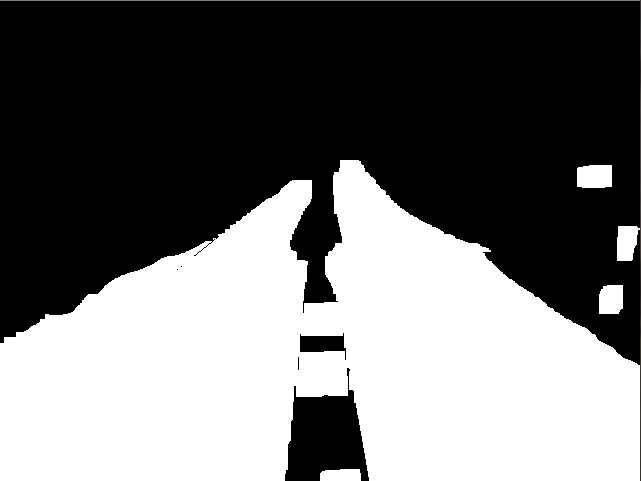

# CALCULATE TRAFFIC CONGESTION VIA CCTV
###### Capstone project in Handong University with Prof Yi

- - - -  

**TRAFFIC CONGESTION CALCULATOR** is for calculating traffic congestion through CCTV images. Firstly we find non-edge area, and then choose the biggest one in non-edge areas. Using that contour information especially scalar value, re-use biggest-contour's LAB value, and filter the image, then find the road. Furthermore, calculate the portion of objects on the road and then convert the values to traffic congestion.

- - - -

## How To Use?

__RoadDetection.h__ is a header file.  
In this program, we use ***OPENCV*** (open-source software).   
Import that header file with cpp file, then just use functions!  


## 1. Header Explanation :

```
----------  Finding Road part  -----------

1. Normalization : Normalize the matrix (Scalar value).
2. nonedge_area : Find non edge area. Supposed non edge area was road.
3. FindLargestArea : Find the largest area in non-edge areas.
4. roadFilter : Contract LAB values for filtering from non-edge-largest area.
5. roadFilter2 : Same with roadFilter, but used BGR only.
6. callBackFunc2 : For checking scalar values from picture where clicked.
7. FindRoad : Find road area using similar 'LAB & BGR' in largest non edge area. Combined all function above.
(If you want to find road, just use this function.)

----------  Count car  -----------
(Still evaluating)

-int ifLRline(Point2f A, Point2f B, Point2f P);
-bool intersection(Point2f o1, Point2f p1, Point2f o2, Point2f p2, Point2f &r);
-void OpticalFlow_Count(int Pnum, vector<uchar> status, int & Car_num, Mat& frame, Point2f & pass, vector<Point2f> after, vector<Point2f> Center, Point2f A, Point2f B);
-double dist(Point2f A, Point2f B);

----------  Machine-Learning for detect Car  -----------
(Learning is another part, this code is just for importing Haar-cascade)

1. detect_haarcascades: Input source & Input Cascade XML's path.

----------  Image Compare for rotate camera  -----------

1. DistHisto : Compare HSV histogram with distributed matrix. Not all part of Image (distribute, and compare). - Recommended -
2. calcEdgeDirection : Calculate pixel's direction, and prepared for using it for comparing images (Seems like HOG).
3. calcEdgeDirection2 : Upgraded version. Plus magnitude calculation. - Recommended - 
4. DistEdgeCompare : Compare 'Edge direction's histogram' with images. - still evaluating. maybe good for finding road-line -
5. DistEdgeCompare2 : Upgraded version. Pluse magnitude calculation.

-------- etc ---------
direct_area, nomalize, calcEdgeDirection3

-> is for testing.

```   
## 2. Find Road
### Find back-ground image, and check where is the road.
     

## 3. Detect the car


  
- - - - 

 
_Handong Global University. Capstone project with Prof.Yi  

Kim you, Lee hansung, Lee taewoo.
_
