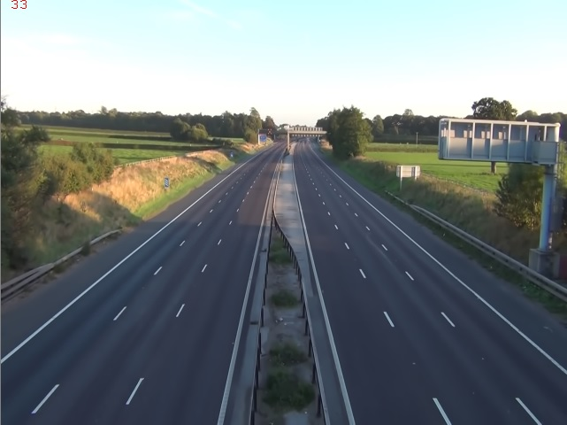

# CALCULATE TRAFFIC CONGESTION VIA CCTV
###### Capstone project in Handong University with Prof Yi

- - - -  

**TRAFFIC CONGESTION CALCULATOR** is for calculating traffic congestion through CCTV images. Firstly we find non-edge area, and then choose the biggest one in non-edge areas. Using that contour information especially scalar value, re-use biggest-contour's LAB value, and filter the image, then find the road. Furthermore, calculate the portion of objects on the road and then convert the values to traffic congestion.

- - - -

## How To Use?

__main.cpp__ is a main file.  
In this program, we use ***OPENCV VERSION 3*** (open-source software).   
***Import our header file in 'src/' with cpp files.***    
And, please check ****FILE PATH****  in ___main.cpp's 33 lines___   


## 1. VARIABLE EXPLANATION IN MAIN FUNCTION :

```
/////Parameters for output/////
bool graphic_box = true;
bool cmd_text = false;


/////Parameters for basic setting/////
String videoname = "traffic.mp4"; //
float vertical_size = 360;
	
  
/////Parameters for background extraction/////
int background_frame_limit_BE = 2000;//The number of frames that determine the termination of the background extraction algorithm.


/////Parameters for primary road area extraction
int win_size_PRA = 5; // window size for detecting non_edge area
float stride_PRA = 0.2; // stride ratio for detecting non_edge area
float no_edge_rate_PRA = 0.0; // The ratio of determining no edge.
float sky_rate_PRA = 0.3;  // The ratio of sky occupied by video (It does not have to be accurate.)
float labcolor_limit_PRA = 10; // Sum of A and B among L, A, B color space.
float sigma_PRA = 3; // what degree of color similarity as a road area.(sigma * standard deviation)
float size_limit_PRA = win_size_PRA * 1.5; // Ignore too small a blob


/////parameters for Optical flow(making the orientation map)
float grid_size_OF = 10; // size of grids
float vec_threshold_OF = 1; // Vector size limit not collecting data
int finish_data_num_OF = 100; // Number of data to finish collection in one grid.
float finish_ratio_OF = 0.8; // The criteria at which the entire data collection process ends (the size of the collected grid / the size of the road).
float valid_ratio_OF = 0.6; // the criteria to allow a grid valid, when process finish.(In this case, there is no angle information, but it is marked as valid)
float invalid_ratio_OF = 0.2; // the creteria to allow a grid invalid.(it is marked as invalid)


//////Parameters for selecting lanes among the lines around the road area.
float decision_ratio_SL = 0.7; // Matched ratio across the lines and angle map
float decision_angle_SL = 15; // what level of angles will be recognized as a match?(degree)


/////parameters for road clustering & segmentation
int num_of_road_SEG = 2;  // number of road direction
int num_of_trape_SEG = 8; // number of road partion
float top_ratio = 0.1; // Percentage of truncation of the top when making a trapezoid in a triangle


/////parameters for foreground detection
int grid_size_FD = 6;  // histogram cell size
float mag_ratio_edgeden_FD = 0.75; 
float mag_ratio_edgeangle_FD = 0.75;
float mag_ratio_edgecolorhist_FD = 0.75;

// Power Ratio for Increase Accuracy
float weight_edgeden_FD = 0.3;
float weight_edgeang_FD = 0.3;
float weight_edgecolorhist_FD = 0.4;

//Weight of each element
float threshold_FD = 0.5; // Final threshold to determine foreground (0.0~1.0)

```   
## 2. Calculate Road Congestion

### Find back-ground image, and check where is the road.
  

### Verify the road area & get outer-most lines 
  


### Divide road area into several trapezoids   
#### (For minimizing the distortion from different distances)   
   


### Calculate Traffic Congestion Ratio (Vehicles area / Road area)
      


## 3. ETC
#### a) Rotate sensing and distribute comparison.
    
  
  
###### If CCTV rotates, then Sobel_Y's edge rapidly decreases.   

#### b) Image Comparison for Sensing Rotation, using Distribute Image Comparison.


#### c) Draw imaginary map, using optical flow
   

### d) Detect cars using YOLO algorithm.
   
###### You can download weight file via this link https://drive.google.com/file/d/0BxrayYHrdwzRV1BacWZoWklDNkU/view?usp=sharing

- - - - 

_Handong Global University. Capstone project with Prof.Yi, Kim you, Lee hansung, Lee taewoo._
